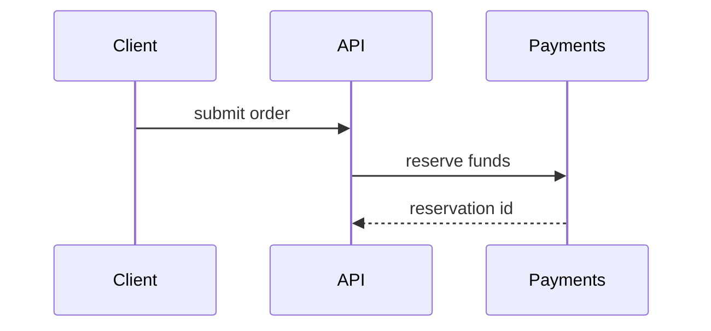

# Visuals for the What section

Pick the smallest view that makes the change obvious; often none is needed.
Put it next to the sentence it supports and keep only the calls, files and
states that matter. Ideas adapted from the `pr` skill in
[mattpocock/skills](https://github.com/mattpocock/skills) (MIT).

## Call tree

Runtime control flow, and where the change sits in it:

```text
submitOrder
  validateOrder
  reserveFunds
    applyDiscount   <- new
  persistOrder
```

## File tree

Ownership of files, for moves and broad refactors:

```text
src/
├── orders/     # owns order state
└── payments/   # talks to the payment provider
```

## Diff sketch

What changes in a shape the reader already knows. Use `diff` for call trees,
file trees or control flow:

```diff
 on(save)
-  write content
+  if content is unchanged
+    return cached result
+  write new content
```

## Mermaid

Interactions between components, rendered by GitHub:



## Code

The whole block, only when most of it is new or the reader needs a copyable
target shape.
